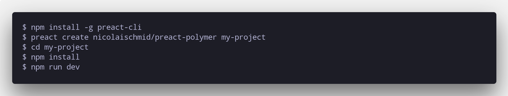

# \preact-polymer template\

# [](https://github.com/nicolaischmid/preact-polymer)

This is a preact-cli template for working with @polymer components, custom templates, etc

## Usage

```
$ npm install -g preact-cli
$ preact create nicolaischmid/preact-polymer my-project
$ cd my-project
$ npm install
$ npm run dev
```
